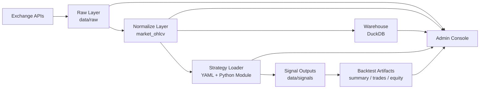

# donkey

> 本地优先的加密货币回测平台，用统一工作区管理行情、策略、信号与回测产物。

`donkey` 的目标，是把原本分散在脚本、目录、数据库和临时笔记里的研究流程，整理成一套可复现、可追踪、可持续迭代的加密货币回测平台。

你可以把它理解为一套面向研究与回测的工作台：

- 前面接多源现货市场
- 中间接数据采集、标准化、策略配置与信号生成
- 后面接 DuckDB、回测产物和管理后台

当前版本已经具备“平台骨架”所需的关键能力，适合个人研究者、小团队、以及准备继续扩展因子层和回测引擎的项目。

## 它解决什么问题

做加密货币回测时，最容易失控的不是策略本身，而是下面这些基础问题：

- 交易对从哪里来，研究 Universe 怎么维护
- 原始行情怎么保存，失败任务怎么续跑
- 标准化数据怎么做版本管理
- 策略配置、代码模块和信号输出怎么关联
- 回测产物存在哪，怎么统一查看
- 工作区里哪些目录是数据、哪些是策略、哪些是产物

`donkey` 把这些问题收敛成统一目录结构、统一命令入口和统一后台视图。

## 平台亮点

- 本地优先
  不依赖重型 Web 框架，直接用 Python 标准库 HTTP Server 启动研究后台。
- 数据可追溯
  raw / normalized / warehouse 三层明确分离，下载 manifest、checkpoint、data version 都有落盘。
- 回测工作区一体化
  数据源、下载任务、本地数据、策略、回测记录放在同一个控制台里管理。
- 策略配置与代码解耦
  用 YAML 描述策略元数据、Universe、产物路径，用 Python 模块实现策略逻辑。
- 热加载友好
  策略模块支持 reload，适合本地快速迭代。
- 对接成本低
  当前平台已经能接收并展示 `summary / trades / equity` 产物，你可以逐步接入自己的回测执行器，而不需要一次重写整套系统。

## 当前功能

- 多数据源交易对浏览
  支持 Binance、OKX、Bybit、Hyperliquid 现货交易对浏览。
- 本地研究清单维护
  把交易对加入本地研究列表，作为后续下载和回测对象。
- Binance 现货 K 线采集
  支持按 symbol / interval 批量下载 raw 数据。
- 断点续传与失败恢复
  下载任务保留 checkpoint、manifest 和失败记录。
- 标准化行情层
  将 raw `jsonl` 统一为 `market_ohlcv` 标准结构。
- DuckDB 数据装载
  将 normalized 数据按 `data_version` 装载到 `db/quant.duckdb`。
- 策略配置与热加载
  支持 YAML 策略定义和 Python 模块热加载。
- 信号生成
  根据 normalized 数据和策略配置生成信号产物。
- 原生回测执行
  使用 `next_bar_open + equal_weight_active` 模型输出 `summary / trades / equity`。
- 成熟库适配
  可选接入 [`bt`](https://pmorissette.github.io/bt/) 作为外部组合回测引擎。
- 回测产物展示
  自动识别 `summary / trades / equity` 文件是否存在，并在后台展示状态和基础指标。
- 系统管理后台
  统一查看数据源、本地数据、策略、回测记录、系统设置和货币图标资源。

## 平台定位

`donkey` 现在应该被理解成：

- 一个加密货币回测平台的工作区与控制台
- 一个可继续扩展的研究基础设施底座
- 一个已经具备数据层、策略层、产物层组织能力的本地产品

它现在还不是：

- 完整的生产级实盘交易系统
- 已经内置完整 Portfolio / Order / Fill 回测撮合器的平台
- 覆盖所有交易所原始下载链路的多源数据中台

这个边界是刻意保留的。当前版本优先把“研究平台的骨架”搭稳，再往回测执行、实验管理和策略评估继续加。

## 适合谁

- 想把自己的量化实验脚本升级成长期可维护项目的人
- 想做本地化、可控、可追踪的加密货币回测工作台的人
- 有自己的回测逻辑，想接入统一数据层和展示层的人
- 需要给团队一个能快速讲清楚结构、流程和目录约定的仓库的人

## 快速开始

### 1. 安装依赖

```bash
python3 -m venv .venv
source .venv/bin/activate
python3 -m pip install --upgrade pip
python3 -m pip install -r requirements.txt
```

### 2. 启动后台

```bash
./.venv/bin/python -m src.admin.pairs_dashboard --host 127.0.0.1 --port 8866
```

浏览器打开：

```text
http://127.0.0.1:8866
```

### 3. 跑通一条最小回测链路

下载 raw 数据：

```bash
python3 -m src.ingestion.binance_ohlcv \
  --symbols BTCUSDT ETHUSDT \
  --intervals 1d \
  --start-date 2024-01-01 \
  --end-date 2025-01-01
```

标准化：

```bash
python3 -m src.normalize.market_ohlcv \
  --input-root data/raw/binance/spot \
  --output-root data/normalized \
  --data-version v1 \
  --output-format parquet
```

装载 DuckDB：

```bash
python3 -m src.warehouse.load_duckdb \
  --normalized-root data/normalized \
  --data-version v1 \
  --db-path db/quant.duckdb
```

生成策略信号：

```bash
python3 -m src.strategies.run \
  --strategy config/strategies/atr_trailing_v1.yaml \
  --input data/normalized/v1/market_ohlcv_1d.parquet \
  --symbols BTCUSDT ETHUSDT
```

运行回测：

```bash
python3 -m src.backtest.run \
  --strategy config/strategies/atr_trailing_v1.yaml \
  --input data/normalized/v1/market_ohlcv_1d.parquet \
  --symbols BTCUSDT ETHUSDT
```

如果你想切到成熟组合回测库 `bt`：

```bash
python3 -m pip install -r requirements-bt.txt
python3 -m src.backtest.run \
  --strategy config/strategies/atr_trailing_v1.yaml \
  --input data/normalized/v1/market_ohlcv_1d.parquet \
  --engine bt
```

如果你想切到第二个外部引擎 `backtrader` 做对比：

```bash
python3 -m pip install -r requirements-backtrader.txt
python3 -m src.backtest.run \
  --strategy config/strategies/atr_trailing_v1.yaml \
  --input data/normalized/v1/market_ohlcv_1d.parquet \
  --engine backtrader
```

更详细的操作流程见：

- [How To Use](./docs/HOW_TO_USE.md)
- [Examples](./docs/EXAMPLES.md)

## 文档导航

- [How To Use](./docs/HOW_TO_USE.md)
  从安装到跑通一条研究/回测链路的实操教程。
- [Architecture](./docs/ARCHITECTURE.md)
  平台分层、数据流、模块职责和扩展点说明。
- [Examples](./docs/EXAMPLES.md)
  内置策略、常见命令和产物落盘示例。
- [Project Structure](./PROJECT_STRUCTURE.md)
  仓库目录结构与职责说明。

## 架构总览



当前核心模块：

- `src/ingestion/binance_ohlcv.py`
  Binance raw K 线下载器，负责 symbol discovery、重试、checkpoint、manifest。
- `src/normalize/market_ohlcv.py`
  标准化层，把 raw 行情整理成统一字段模型。
- `src/warehouse/load_duckdb.py`
  装载层，把 normalized 数据按版本导入 DuckDB。
- `src/strategies/run.py`
  策略信号层，读取策略配置与策略模块，输出信号文件。
- `src/backtest/run.py`
  回测执行层，读取策略配置、策略模块与 normalized 数据，输出 summary / trades / equity。
- `src/admin/pairs_dashboard.py`
  管理后台，负责浏览数据源、本地数据、策略、回测记录与系统信息。

## 产品页面

当前后台已经形成完整的产品页面结构：

- 首页
  展示数据源总览、本地交易对、本地数据量、下载任务数、策略数、回测记录数和系统关键信息。
- 数据源
  浏览远端交易对，筛选交易状态与报价资产，并加入本地研究清单。
- 本地数据
  查看 `data/raw/<source>/spot` 下已存在的数据文件与更新时间。
- 策略展示
  自动扫描 `config/strategies/*.yaml`，展示策略描述、Universe、回测区间和产物路径。
- 回测记录
  展示 `summary / trades / equity` 的存在状态和指标摘要。
- 系统设置
  展示工作区路径、数据库路径、日志路径、图标资源、默认过滤设置等系统信息。

如果你要在 GitHub 首页展示截图，推荐放到 `docs/screenshots/`。

## 为什么这个仓库值得继续做

相比“几个脚本 + 几个数据目录”的实验项目，`donkey` 已经有了明显的平台化特征：

- 有明确的数据分层和目录契约
- 有统一后台，而不只是 CLI
- 有策略配置层，而不只是硬编码逻辑
- 有回测产物展示层，而不只是临时文件
- 有 DuckDB 仓库层，方便后续接因子、实验和评估

这意味着你后续再补下面这些能力时，不需要推倒重来：

- 因子计算层
- 回测执行引擎
- 组合管理层
- 评估与实验追踪
- 实盘接口层

## 当前边界

为了避免误解，当前版本的边界明确如下：

- 多源支持目前主要覆盖交易对浏览和本地研究清单管理
- 已落地的 raw K 线下载器当前是 Binance
- 平台已经内置轻量回测执行器和可选 `bt` 适配层，但还不是订单级高保真撮合器
- 平台当前定位是本地单机研究控制台，而不是多用户 SaaS

## Roadmap

- 增加 OKX / Bybit / Hyperliquid 原始数据采集器
- 增加 factor layer 和统一因子产物
- 增强 backtest runner，补充更细粒度订单撮合和组合约束
- 增加 experiment tracking 和参数对比
- 增加 CI、格式检查、发布流程和版本标签
- 增加仓库内嵌截图和示例数据

## License

Apache License 2.0，见 [LICENSE](./LICENSE)。
