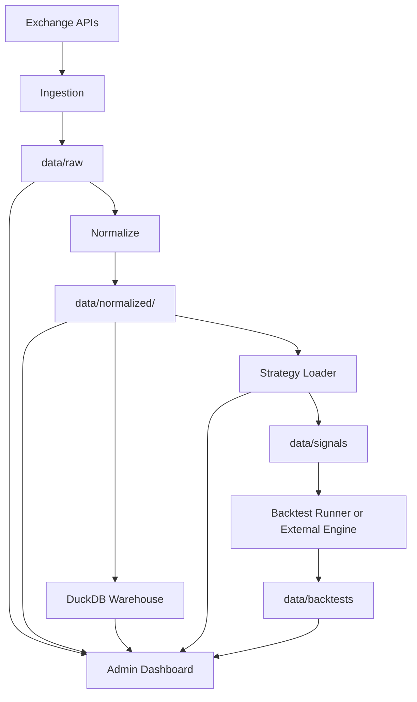

# Architecture

这份文档说明 `donkey` 作为加密货币回测平台的整体架构、数据分层和扩展点。

## 1. 平台视角

`donkey` 不是只做某一个脚本功能，而是把研究和回测工作流拆成几个彼此独立但可以串起来的层：

1. 数据源层
2. 原始数据层
3. 标准化层
4. 仓库层
5. 策略层
6. 信号层
7. 回测产物层
8. 管理后台层

## 2. 总体数据流



## 3. 分层说明

### 数据源层

当前支持：

- Binance
- OKX
- Bybit
- Hyperliquid

当前落地情况：

- 多源交易对发现已经支持
- Binance raw 下载器已经支持
- 其他数据源的 raw 下载链路仍可在现有结构上继续扩展

### 原始数据层

路径约定：

```text
data/raw/<source>/spot/<symbol>/<interval>/
```

核心原则：

- 原始返回尽量不改
- 每次下载保留独立 run 产物
- 失败任务可以 checkpoint 续跑
- manifest 用于描述这次批量下载的上下文

raw 层要解决的是“保真”和“可追溯”，不是“方便分析”。

### 标准化层

路径约定：

```text
data/normalized/<data_version>/market_ohlcv_<interval>.jsonl|parquet
```

核心原则：

- 统一字段命名
- 统一时间格式
- 去重
- 用 `data_version` 管理数据版本

这层的目标，是把不同下载批次整理成统一的研究输入。

### 仓库层

数据库：

- `db/quant.duckdb`
- `db/experiments.duckdb`

当前作用：

- 统一装载 `market_ohlcv`
- 为后续因子、信号、实验和评估预留表结构

这层的价值，是让研究从“文件驱动”升级成“文件 + 仓库双轨驱动”。

### 策略层

策略由两部分组成：

- YAML 配置
- Python 策略模块

YAML 负责：

- 策略名称和版本
- Universe
- 数据依赖
- 风控和回测区间
- 产物路径

Python 模块负责：

- 具体信号逻辑
- 热加载友好的策略实现

这种拆分的好处是：

- 策略元数据可展示
- 产物路径可统一管理
- 逻辑代码和配置代码不会混在一起

### 信号层

信号层当前由 `src/strategies/run.py` 提供。

作用：

- 读取 normalized 数据
- 加载策略定义
- 输出 signal files

信号层不是完整回测执行器，但它已经把“数据输入”和“策略逻辑”连接起来了。

### 回测产物层

平台当前默认识别：

- `summary.json`
- `trades.parquet`
- `portfolio_equity.parquet`

这意味着：

- 如果你已经有自己的 backtest runner
- 只要把产物按策略 YAML 中的路径写好
- 后台就能自动识别和展示

### 管理后台层

后台是 `src/admin/pairs_dashboard.py`。

它负责：

- 数据源交易对浏览
- 本地数据浏览
- 下载任务管理
- 策略展示
- 回测记录展示
- 系统设置展示

这个后台的价值在于，它让平台从“命令行项目”变成“有产品界面的研究工具”。

## 4. 当前核心模块

### `src/ingestion/binance_ohlcv.py`

负责：

- Binance exchangeInfo symbol discovery
- K 线批量下载
- retry / fallback
- checkpoint
- manifest

### `src/normalize/market_ohlcv.py`

负责：

- 从 raw 读取下载结果
- 统一转换为 `market_ohlcv`
- 去重
- 按 interval 输出文件

### `src/warehouse/load_duckdb.py`

负责：

- 扫描 normalized version 目录
- 导入 DuckDB
- 保证相同版本/周期重复装载时具备幂等替换行为

### `src/strategies/loader.py`

负责：

- 解析 YAML
- 解析策略模块路径
- 动态加载 Python 策略模块
- 监控文件变化并热重载

### `src/strategies/run.py`

负责：

- 读取 normalized 数据
- 调用策略
- 生成 signal 输出

### `src/admin/pairs_dashboard.py`

负责：

- UI 页面
- HTTP API
- 下载任务后台线程
- 策略/回测记录扫描

## 5. 目录契约

平台可持续演进的关键，不只是代码模块，而是目录契约稳定。

核心目录：

- `data/raw/`
- `data/normalized/`
- `data/signals/`
- `data/backtests/`
- `config/strategies/`
- `db/`

未来如果增加：

- 因子层
- 实验层
- 正式 backtest runner

也建议沿着这种“目录即契约”的方式继续扩展。

## 6. 扩展建议

最自然的扩展顺序如下：

1. 增加更多交易所 raw 下载器
2. 增加 factor calculation layer
3. 增加正式 backtest runner
4. 增加 experiment tracking
5. 增加 performance analytics
6. 增加 live trading adapter

## 7. 为什么这套结构合理

因为它把长期会反复变化的东西，拆到了独立层里：

- 数据来源会变
- 数据版本会变
- 策略逻辑会变
- 回测产物会变
- 展示界面会变

但目录契约、平台分层和后台入口可以保持稳定。

这就是 `donkey` 最重要的“产品化价值”。
